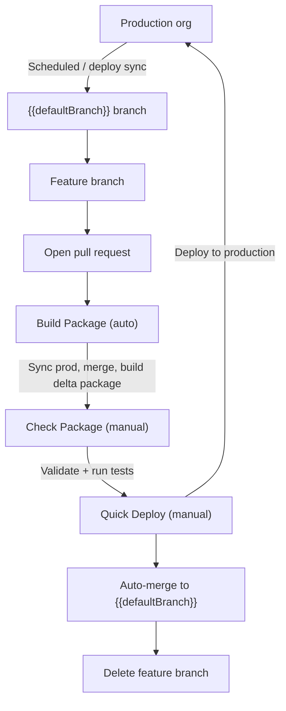

# Bitbucket CI/CD for Salesforce

This project uses Bitbucket Pipelines to validate and deploy Salesforce metadata safely. The pipeline keeps `{{defaultBranch}}` in sync with production, builds only the metadata that changed, and requires human approval before anything reaches production. You do not need to be a developer to follow this workflow — create a branch, commit your changes, open a pull request, and use the pipeline buttons when you are ready.

## How it works



## Golden rule

**`{{defaultBranch}}` == production.**

Nothing should be committed or merged into `{{defaultBranch}}` unless it has already been successfully deployed. The CI process enforces this: Quick Deploy merges your branch only after a successful deployment.

## Deploying a change

Follow these steps every time you want to move metadata from your sandbox (or retrieved changes) into production.

### 1. Create a feature branch

Branch off `{{defaultBranch}}`. Give the branch a short, descriptive name (for example `feature/update-account-validation`).

### 2. Commit your changes

Add the metadata you changed under `src/`. Commit with a clear message describing what changed and why.

### 3. Open a pull request

Open a PR targeting `{{defaultBranch}}`. The **Build Package** step starts automatically.

### 4. Wait for Build Package

Build Package:

1. Syncs the latest production metadata into `{{defaultBranch}}` (unless you used `!skipSync` in the PR description).
2. Merges `{{defaultBranch}}` into your feature branch so conflicts surface early.
3. Builds an incremental deployment package with sfdx-git-delta, including `destructiveChanges.xml` when deletions are detected.

When it finishes, download the pipeline artifacts to inspect `package.xml` and `destructiveChanges.xml` if needed.

### 5. Run Check Package

Click **Check Package** in the pipeline. This performs a check-only deployment against production and runs Apex tests. Test results are posted on the pull request.

Review the results before proceeding. If tests fail, fix the issues on your branch and push — Build Package will run again.

### 6. Quick Deploy

When Check Package succeeds and the PR is approved, click **Quick Deploy**. This:

1. Deploys the previously validated package to production (no re-run of tests).
2. Merges your branch into `{{defaultBranch}}`.
3. Deletes the feature branch.

You are done. Production and `{{defaultBranch}}` are back in sync.

## PR report cards

After **Build Package** completes, a **Deployment Package** report card appears on the pull request with a plain-language summary of the package contents ("This deployment contains: 3 Flows, 2 Apex Classes. Deletions: 1 Field."), plus component count, metadata types, and a destructive-changes indicator.

After Build Package, a **Code Analysis** report card summarizes Salesforce Code Analyzer findings for changed files, and each finding is pinned as an inline annotation on the exact file and line in the PR diff (severity-badged, sorted by severity, capped at Bitbucket's 1,000-annotation limit).

After **Check Package** completes (whether it passed or failed), a **Validation Results** report card appears with pass/fail status, tests run and failed, and code coverage when available. When validation fails, component deploy errors and Apex test failures are annotated inline on the offending files/lines in the diff (test failures resolved to the test class from the stack trace).

Report cards and inline annotations use Bitbucket's in-pipeline authentication, need **no configuration at all**, and never block the build if publishing fails.

## PR description flags

Add these anywhere in the pull request description. They are case-insensitive.

| Flag             | What it does                                                           | When to use                                                                         |
| ---------------- | ---------------------------------------------------------------------- | ----------------------------------------------------------------------------------- |
| `!skipSync`      | Skips syncing production into `{{defaultBranch}}` during Build Package | You know production has not changed since the last sync and want a faster build     |
| `!tests=Foo,Bar` | Runs only the listed Apex test classes during Check Package            | Large orgs where a full test run is slow and you know which tests cover your change |

Example:

```
Update Account validation rule.

!tests=AccountValidationTest,AccountTriggerTest
```

## Manual pipelines

Beyond the PR pipeline, you can run these from **Pipelines → Run pipeline → Custom**:

| Pipeline                                   | What it does                                                                                                      | When to use                                                                                      |
| ------------------------------------------ | ----------------------------------------------------------------------------------------------------------------- | ------------------------------------------------------------------------------------------------ |
| **Sync Production**                        | Pulls production metadata into `{{defaultBranch}}` and commits                                                    | Production changed outside the normal PR flow and you need `{{defaultBranch}}` updated now       |
| **Deploy to Production**                   | Syncs production, builds a package from the current branch, deploys with all tests, merges to `{{defaultBranch}}` | Emergency or hotfix deploy from a branch without going through the PR Check/Quick Deploy steps   |
| **Deploy to Production (Selective Tests)** | Same as above but runs only the test classes you specify                                                          | Hotfix where you need a faster deploy and know which tests to run                                |
| **Scheduled Production Sync**              | Checks when production was last synced; syncs if the interval has elapsed                                         | Runs on a schedule to keep `{{defaultBranch}}` close to production even when no one is deploying |

For **Deploy to Production** pipelines, set **Enter1ToSkipProdSync** to `1` if you want to skip the production sync step.

## Scheduled production sync

A daily (recommended) schedule on `{{defaultBranch}}` runs **Scheduled Production Sync**. It compares the time since the last "Auto-Pull of Production" commit against a configurable interval.

| Variable                   | Default    | Purpose                                                                                                               |
| -------------------------- | ---------- | --------------------------------------------------------------------------------------------------------------------- |
| `PRODUCTION_SYNC_INTERVAL` | `3` (days) | Minimum days between automatic production syncs                                                                       |
| `SYNC_AS_PR`               | unset      | When set to `1`, production changes are opened as a pull request instead of committed directly to `{{defaultBranch}}` |

Set these under **Repository settings → Pipelines → Repository variables**.

Recommended schedule: daily at a low-traffic time (for example 3:00 AM), branch `{{defaultBranch}}`, pipeline **Scheduled Production Sync**.

## Bitbucket API credentials

| Variable                 | Secured | Purpose                                       |
| ------------------------ | ------- | --------------------------------------------- |
| `BITBUCKET_USERNAME`     | Yes     | Bitbucket account username for REST API calls |
| `BITBUCKET_APP_PASSWORD` | Yes     | Bitbucket app password for REST API calls     |

These are required to parse PR description flags (`!skipSync`, `!tests=`) during **Build Package** and **Check Package**, and to open pull requests when `SYNC_AS_PR=1`. Add them as secured repository variables alongside the others.

## Setup

The fastest path: run `npx generator-ccc` in your project — it scaffolds the pipeline files and walks you through Bitbucket configuration.

### Manual fallback checklist

If you need to configure Bitbucket yourself:

1. **Enable Pipelines** — Repository settings → Pipelines → Settings → Enable Pipelines.
2. **Add AUTH_URL** — Authorize your production org locally, then run `sf org display --verbose` and copy the Sfdx Auth URL. Create a **secured** repository variable named `AUTH_URL` (check the "Secured" box).
3. **Schedule production sync** — Pipelines → Schedules → New schedule → branch `{{defaultBranch}}`, pipeline **Scheduled Production Sync**, interval **daily**.

## Troubleshooting

| Symptom                                          | Likely cause                                                    | What to do                                                                                                                                                                   |
| ------------------------------------------------ | --------------------------------------------------------------- | ---------------------------------------------------------------------------------------------------------------------------------------------------------------------------- |
| Pipeline fails immediately with auth error       | `AUTH_URL` expired or invalid                                   | Re-authorize the production org, run `sf org display --verbose`, update the secured `AUTH_URL` variable                                                                      |
| Build Package fails on merge                     | Conflict between your branch and synced `{{defaultBranch}}`     | Pull latest `{{defaultBranch}}`, merge or rebase into your feature branch, resolve conflicts, push                                                                           |
| Quick Deploy fails with "validation invalidated" | Too much time passed since Check Package, or production changed | Re-run **Check Package**, then try Quick Deploy again                                                                                                                        |
| Check Package reports test failures              | Apex tests failed against the check-only deploy                 | Fix failing tests or metadata on your branch, push, wait for Build Package, re-run Check Package                                                                             |
| Scheduled sync never runs                        | Schedule not created or interval not elapsed                    | Confirm the schedule exists on `{{defaultBranch}}`; check `PRODUCTION_SYNC_INTERVAL` value and last sync commit message                                                      |
| Package is empty or missing expected metadata    | Change not committed or not in `src/`                           | Verify files are tracked in git under `src/`; run the **SF: Preview Deployment Package** task locally to compare                                                             |
| No report cards or inline annotations on the PR  | Report publishing skipped or failed (it never blocks the build) | Check the Build Package or Check Package log for WARN lines from `insights.sh`; annotations on lines not part of the PR diff are only visible in the report view, not inline |
